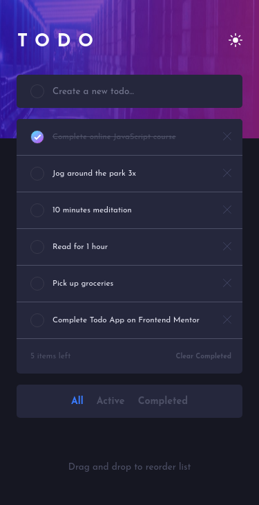

# Frontend Mentor - Todo app solution

This is a solution to the [Todo app challenge on Frontend Mentor](https://www.frontendmentor.io/challenges/todo-app-Su1_KokOW). Frontend Mentor challenges help you improve your coding skills by building realistic projects.

## Table of contents

- [Overview](#overview)
  - [The challenge](#the-challenge)
  - [Screenshot](#screenshot)
  - [Links](#links)
- [My process](#my-process)
  - [Built with](#built-with)
  - [What I learned](#what-i-learned)
  - [Useful resources](#useful-resources)
- [Author](#author)

## Overview

This is the front-end mentor's nineteen challenge. The challenge is to build the "Todo App" and make it as close to the design as possible. Building the desing with whatever you want to finish, any language, framework or tools.

### The challenge

Users should be able to:

- View the optimal layout for the app depending on their device's screen size
- See hover states for all interactive elements on the page
- Add new todos to the list
- Mark todos as complete
- Delete todos from the list
- Filter by all/active/complete todos
- Clear all completed todos
- Toggle light and dark mode
- **Bonus**: Drag and drop to reorder items on the list

## Screenshot

### Mobile design

<p  align="center">
  </img>
</p>
<p  align="center">
  </img>
</p>

### Tablets design

<p  align="center"></img></p>
<p  align="center"></img></p>

### Desktop design

<p  align="center"></img></p>
<p  align="center"></img></p>

<!--### result of my work

<p  align="center"></img></p> -->

### Links

<!-- - Solution URL: [My solution for this challenge](https://www.frontendmentor.io/solutions/job-listings-with-filtering-react-typescript-and-stylescomponens-kLWMlWkVR)
- Live Site URL: [check the result](https://jcdmeira-filter-jobs.netlify.app) -->

- My figma design: [Figma](https://www.figma.com/file/rTGUE7e5Te4e4QYPkPt3JU/19-todo?node-id=0%3A1)

## My process

### Built with

- Mobile-first workflow
- typeScript
- [React](https://reactjs.org/) - JS library
- [Styled components](https://styled-components.com) - CSS in js with stiled components

### What I learned

<!--
</br>
<div align='right'>

</div>
</br>

```tsx

``` -->

### Useful resources

- [react tutorial](https://pt-br.reactjs.org/tutorial/tutorial.html) - This helped me structure the components and build the proposed page.
- [my figma design](https://www.figma.com/file/rTGUE7e5Te4e4QYPkPt3JU/19-todo?node-id=0%3A1) - My figma design for help anyone who wants to build this challenge.
- [CSS units conversor - px to VH/VW/REM](https://it-news.pw/pxtovh/) - CSS units conversor .
- [Converting Colors](https://convertingcolors.com) - HSL for all color systems.

## Author

- Personal Page - [Jean Carlos De Meira](https://jcdmeira.github.io)
- Frontend Mentor - [@JCDMeira](https://www.frontendmentor.io/profile/JCDMeira)
- Instagram - [@jean.meira10](https://www.instagram.com/jean.meira10/)
- GitHub - [JCDMeira](https://github.com/JCDMeira)
